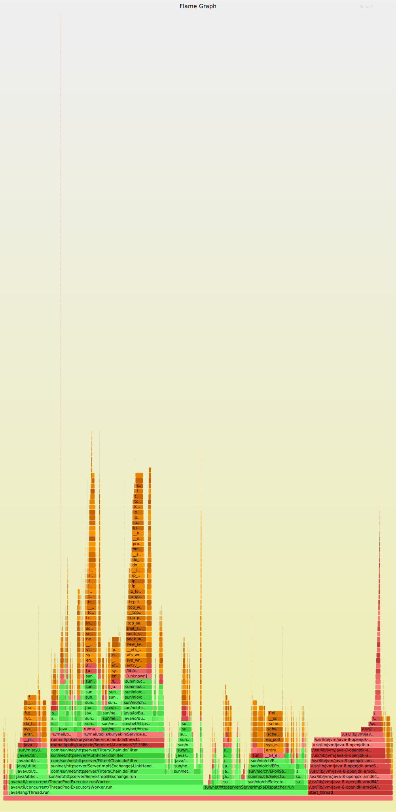

# Нагрузочное тестирование

Для тестирования был настроен кластер из трёх узлов, развёрнутый в виртуальной машине и контейнерах, содержащихся в виртуальной машине. Для создания виртуальной машины использовался Oracle VirtualBox. На виртуальную машину была установлена ОС Ubuntu LTE 16.04. Была настроено сетевое подключение между гостевой системой (Ubuntu LTE 16.04) и хостовой системой (Windows 10). Ещё два узла кластера запускались в linux контейнерах (LXC, использовались предоставленные образы ubuntu-daily:16.04).

Нагрузка происходила с помощью утилиты wrk. Тестирование происходило тремя скриптами: GET, PUT, PUT_GET, в течение 1 минуты, на 1,2 и 4 тредах и 1,2 и 4 коннектах, каждый. Скрипты расположены в папке scripts.

## До оптимизаций

### Put:

**1 тред, 1 коннект**
```
$ wrk --latency -t1 -c1 -d1m -s put.lua http://localhost:8080
Running 1m test @ http://localhost:8080
  1 threads and 1 connections
  Thread Stats   Avg      Stdev     Max   +/- Stdev
    Latency    44.02ms    1.37ms  52.14ms   96.11%
    Req/Sec    22.69      4.52    30.00     71.86%
  Latency Distribution
     50%   44.02ms
     75%   44.20ms
     90%   44.58ms
     99%   48.10ms
  1362 requests in 1.00m, 155.46KB read
Requests/sec:     22.69
Transfer/sec:      2.59KB
```

**2 треда, 2 коннекта**

```
$ wrk --latency -t2 -c2 -d1m -s put.lua http://localhost:8080
Running 1m test @ http://localhost:8080
  2 threads and 2 connections
  Thread Stats   Avg      Stdev     Max   +/- Stdev
    Latency    53.86ms   64.81ms 892.34ms   96.89%
    Req/Sec    22.25      5.06    30.00     70.65%
  Latency Distribution
     50%   44.01ms
     75%   44.29ms
     90%   44.86ms
     99%  385.90ms
  2610 requests in 1.00m, 298.06KB read
Requests/sec:     43.44
Transfer/sec:      4.96KB
```

**4 треда, 4 коннекта**

```
$ wrk --latency -t4 -c4 -d1m -s put.lua http://localhost:8080
Running 1m test @ http://localhost:8080
  4 threads and 4 connections
  Thread Stats   Avg      Stdev     Max   +/- Stdev
    Latency    44.99ms    8.12ms 207.01ms   98.70%
    Req/Sec    22.37      4.64    30.00     72.50%
  Latency Distribution
     50%   44.02ms
     75%   44.31ms
     90%   45.56ms
     99%   71.02ms
  5368 requests in 1.00m, 613.02KB read
Requests/sec:     89.33
Transfer/sec:     10.20KB
```

### Get:

**1 тред, 1 коннект**

```
$ wrk --latency -t1 -c1 -d1m -s get.lua http://localhost:8080
Running 1m test @ http://localhost:8080
  1 threads and 1 connections
  Thread Stats   Avg      Stdev     Max   +/- Stdev
    Latency    47.53ms   20.48ms 293.28ms   96.87%
    Req/Sec    22.08      4.96    30.00     72.57%
  Latency Distribution
     50%   44.05ms
     75%   44.43ms
     90%   47.45ms
     99%  160.82ms
  1309 requests in 1.00m, 107.30KB read
Requests/sec:     21.78
Transfer/sec:      1.79K
```

**2 треда, 2 коннекта**

```
$ wrk --latency -t2 -c2 -d1m -s get.lua http://localhost:8080
Running 1m test @ http://localhost:8080
  2 threads and 2 connections
  Thread Stats   Avg      Stdev     Max   +/- Stdev
    Latency    47.00ms   24.02ms 455.79ms   98.04%
    Req/Sec    22.28      4.77    30.00     72.42%
  Latency Distribution
     50%   44.03ms
     75%   44.31ms
     90%   45.15ms
     99%  145.76ms
  2655 requests in 1.00m, 217.62KB read
Requests/sec:     44.21
Transfer/sec:      3.62KB
```

**4 треда, 4 коннекта**

```
$ wrk --latency -t4 -c4 -d1m -s get.lua http://localhost:8080
Running 1m test @ http://localhost:8080
  4 threads and 4 connections
  Thread Stats   Avg      Stdev     Max   +/- Stdev
    Latency    44.46ms    7.66ms 251.60ms   99.54%
    Req/Sec    22.62      4.54    30.00     72.15%
  Latency Distribution
     50%   44.02ms
     75%   44.24ms
     90%   44.64ms
     99%   48.36ms
  5426 requests in 1.00m, 444.68KB read
Requests/sec:     90.35
Transfer/sec:      7.40KB
```

### Put_Get:

**1 тред, 1 коннект**

```
$ wrk --latency -t1 -c1 -d1m -s put_get.lua http://localhost:8080
Running 1m test @ http://localhost:8080
  1 threads and 1 connections
  Thread Stats   Avg      Stdev     Max   +/- Stdev
    Latency    46.36ms   25.17ms 508.36ms   99.19%
    Req/Sec    22.43      4.48    30.00     74.07%
  Latency Distribution
     50%   44.06ms
     75%   44.30ms
     90%   46.94ms
     99%   56.74ms
  1340 requests in 1.00m, 108.53KB read
Requests/sec:     22.31
Transfer/sec:      1.81KB
```

**2 треда, 2 коннекта**

```
$ wrk --latency -t2 -c2 -d1m -s put_get.lua http://localhost:8080
Running 1m test @ http://localhost:8080
  2 threads and 2 connections
^[[A^[[  Thread Stats   Avg      Stdev     Max   +/- Stdev
    Latency    45.37ms   15.85ms 384.21ms   99.08%
    Req/Sec    22.49      4.56    30.00     72.86%
  Latency Distribution
     50%   44.04ms
     75%   44.27ms
     90%   44.89ms
     99%   52.67ms
  2693 requests in 1.00m, 218.12KB read
Requests/sec:     44.82
Transfer/sec:      3.63KB
```

**4 треда, 4 коннекта**

```
$ wrk --latency -t4 -c4 -d1m -s put_get.lua http://localhost:8080
Running 1m test @ http://localhost:8080
  4 threads and 4 connections
  Thread Stats   Avg      Stdev     Max   +/- Stdev
    Latency    48.85ms   33.42ms 544.98ms   97.46%
    Req/Sec    22.07      4.83    30.00     72.79%
  Latency Distribution
     50%   44.07ms
     75%   44.49ms
     90%   47.87ms
     99%  199.92ms
  5234 requests in 1.00m, 423.93KB read
Requests/sec:     87.15
Transfer/sec:      7.06KB
```

## Профилирование

Для профилирования использовался async-profiler, который подключался к java машине, запущенной на виртуальной машине. На время профилирование (30 секунд) на кластер подавалась нагрузка из смешанных PUT и GET запросов с помощью ранее реализованного lua скрипта и утириты wrk. Результаты профилирования были сохранены в файл и преобразованы в график с помощью скрипта flamegrahp.pl (https://github.com/BrendanGregg/FlameGraph).

Ниже приведён полученный график с результатами профилирования:


Про профилировав и увидев, что сервер тратит крайне мало времени на создание потоков и ознакомившись с документацией по серверу, было принято решение использовать класс Executor для распределения нагрузки по потокам.

## После оптимизаций

После внесения измениний, код был протестирован вышеупомянутыми скриптами.

### Put:

**1 тред, 1 коннект**
```
$ wrk --latency -t1 -c1 -d1m -s put.lua http://localhost:8080
Running 1m test @ http://localhost:8080
  1 threads and 1 connections
  Thread Stats   Avg      Stdev     Max   +/- Stdev
    Latency    44.84ms    3.55ms  97.83ms   88.72%
    Req/Sec    22.17      4.37    30.00     74.58%
  Latency Distribution
     50%   44.08ms
     75%   44.86ms
     90%   48.13ms
     99%   59.58ms
  1338 requests in 1.00m, 154.10KB read
Requests/sec:     22.26
Transfer/sec:      2.56KB
```

**2 треда, 2 коннекта**

```
$ wrk --latency -t2 -c2 -d1m -s put.lua http://localhost:8080
Running 1m test @ http://localhost:8080
  2 threads and 2 connections
  Thread Stats   Avg      Stdev     Max   +/- Stdev
    Latency    44.69ms    2.39ms  62.10ms   81.80%
    Req/Sec    22.24      4.37    30.00     75.25%
  Latency Distribution
     50%   44.09ms
     75%   44.95ms
     90%   47.80ms
     99%   52.08ms
  2681 requests in 1.00m, 308.78KB read
Requests/sec:     44.64
Transfer/sec:      5.14KB
```

**4 треда, 4 коннекта**

```
$ wrk --latency -t4 -c4 -d1m -s put.lua http://localhost:8080
Running 1m test @ http://localhost:8080
  4 threads and 4 connections
  Thread Stats   Avg      Stdev     Max   +/- Stdev
    Latency    44.73ms    2.61ms  92.29ms   83.43%
    Req/Sec    22.26      4.38    30.00     75.00%
  Latency Distribution
     50%   44.09ms
     75%   44.81ms
     90%   47.85ms
     99%   51.26ms
  5362 requests in 1.00m, 617.57KB read
Requests/sec:     89.25
Transfer/sec:     10.28KB
```

### Get:

**1 тред, 1 коннект**

```
$ wrk --latency -t1 -c1 -d1m -s get.lua http://localhost:8080
Running 1m test @ http://localhost:8080
  1 threads and 1 connections
  Thread Stats   Avg      Stdev     Max   +/- Stdev
    Latency    44.99ms    5.44ms 135.47ms   95.45%
    Req/Sec    22.22      4.53    30.00     73.52%
  Latency Distribution
     50%   44.07ms
     75%   44.65ms
     90%   47.82ms
     99%   60.14ms
  1335 requests in 1.00m, 144.16KB read
  Non-2xx or 3xx responses: 1188
Requests/sec:     22.24
Transfer/sec:      2.40KB
```

**2 треда, 2 коннекта**

```
$ wrk --latency -t2 -c2 -d1m -s get.lua http://localhost:8080
Running 1m test @ http://localhost:8080
  2 threads and 2 connections
  Thread Stats   Avg      Stdev     Max   +/- Stdev
    Latency    44.84ms    3.59ms 117.94ms   92.49%
    Req/Sec    22.19      4.43    30.00     74.41%
  Latency Distribution
     50%   44.12ms
     75%   45.02ms
     90%   47.88ms
     99%   55.03ms
  2675 requests in 1.00m, 289.03KB read
  Non-2xx or 3xx responses: 2381
Requests/sec:     44.56
Transfer/sec:      4.82KB
```

**4 треда, 4 коннекта**

```
s$ wrk --latency -t4 -c4 -d1m -s get.lua http://localhost:8080
Running 1m test @ http://localhost:8080
  4 threads and 4 connections
  Thread Stats   Avg      Stdev     Max   +/- Stdev
    Latency    44.79ms    2.64ms  90.51ms   82.74%
    Req/Sec    22.21      4.39    30.00     74.87%
  Latency Distribution
     50%   44.13ms
     75%   45.08ms
     90%   47.96ms
     99%   52.06ms
  5357 requests in 1.00m, 578.85KB read
  Non-2xx or 3xx responses: 4769
Requests/sec:     89.14
Transfer/sec:      9.63KB
```

### Put_Get:

**1 тред, 1 коннект**

```
$ wrk --latency -t1 -c1 -d1m -s put_get.lua http://localhost:8080
Running 1m test @ http://localhost:8080
  1 threads and 1 connections
  Thread Stats   Avg      Stdev     Max   +/- Stdev
    Latency    44.88ms    3.64ms  82.14ms   90.34%
    Req/Sec    22.14      4.37    30.00     74.70%
  Latency Distribution
     50%   44.06ms
     75%   44.91ms
     90%   47.96ms
     99%   60.39ms
  1335 requests in 1.00m, 108.13KB read
Requests/sec:     22.25
Transfer/sec:      1.80KB
```

**2 треда, 2 коннекта**

```
$ wrk --latency -t2 -c2 -d1m -s put_get.lua http://localhost:8080
Running 1m test @ http://localhost:8080
  2 threads and 2 connections
  Thread Stats   Avg      Stdev     Max   +/- Stdev
    Latency    45.00ms    4.16ms 136.77ms   93.75%
    Req/Sec    22.13      4.34    30.00     75.63%
  Latency Distribution
     50%   44.15ms
     75%   45.33ms
     90%   48.08ms
     99%   54.84ms
  2667 requests in 1.00m, 216.01KB read
Requests/sec:     44.40
Transfer/sec:      3.60KB
```

**4 треда, 4 коннекта**

```
$ wrk --latency -t4 -c4 -d1m -s put_get.lua http://localhost:8080
Running 1m test @ http://localhost:8080
  4 threads and 4 connections
  Thread Stats   Avg      Stdev     Max   +/- Stdev
    Latency    44.73ms    2.82ms 104.57ms   85.62%
    Req/Sec    22.23      4.38    30.00     74.66%
  Latency Distribution
     50%   44.12ms
     75%   44.97ms
     90%   47.74ms
     99%   52.10ms
  5364 requests in 1.00m, 434.45KB read
Requests/sec:     89.26
Transfer/sec:      7.23KB
```
## Профилирование

Ниже приведён полученный график с результатами профилирования:


# Вывод 
Был создан сервер с использование библиотек java. Был проведено тестирование сервера, по результатам тестирования были внесены исправления в код. Но так как данный сервер, судя по API, сам по себе не поддерживает асинхронность в понимании NIO, добиться серьезных улучшений не удается.
